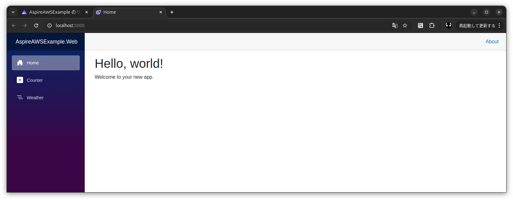

# aws_dotnet_aspire_blazor

## 概要
* AWS SAM で CloudFront + S3 + API Gateway HTTP + Lambda を構築する
* .NET Blazor WebAssembly + Lambda(.NET) で主に .NET の技術者を対象としている
* ローカル開発を .NET Aspire + .NET Aspire for AWS で効率化する

  
  

クイック スタート: 初めての .NET.NET Aspire ソリューションを構築する  
https://learn.microsoft.com/ja-jp/dotnet/aspire/get-started/build-your-first-aspire-app?pivots=dotnet-cli  

Integrations with .NET Aspire for AWS  
https://github.com/aws/integrations-on-dotnet-aspire-for-aws  

## 課題
* AppHost のプロジェクトで警告が出る 
  * XXXX is referenced by an Aspire Host project, but it is not an executable. (ASPIRE004)
  * Lambda をクラスライブラリで実装しているが、本来の .NET Aspire は実行ファイルを想定しているため上記の警告が表示される
* .NET Aspire の ServiceDefaults を実装していない
* .NET Aspire の 構造化、トレース、メトリックが機能していない
* .NET Aspire のデバッグ実行時に、値の確認やブレークポイントが使用できない
* サービスモックが Services の中にある
* Web をモックで起動するのに Web も Program.cs を書き換える必要がある

## 詳細

### ソリューションの構築
[docs/ソリューション構築.md](docs/ソリューション構築.md)

### ローカル実行

* 全体を実行: AppHost を実行
* Lambda を単体実行: 各 Lambda の test から実行
* Web を単体実行: Web を実行
* Web をモックで単体実行: Web の Program.cs でコメントアウトされている開発用を戻して実行

#### AppHost
##### `F5` または以下のコマンドを実行
```
dotnet run --project AspireAWSExample.AppHost
```


##### http://localhost:5000 


##### コンソールからログの確認が可能


#### Lambda
test のテストの実行から実行する。  


#### Web
以下のどちらかを実行する。  
モックを使用したい場合は、Program.cs でコメントアウトされている開発用を戻してから実行する。  
```
dotnet run --project AspireAWSExample.Web
```
```
dotnet watch --project ./AspireAWSExample.Web
```

### デプロイ

1. .env.template から .env を作成し AWS への接続情報を記述
1. AWS への接続確認
    ```
    ./scripts/01_test_aws_connect.sh
    ```
1. AWS へのデプロイを実行
    ```
    ./scripts/10_deploy_stack_to_cloudformation.sh
    ```
1. Web をビルドしコンテンツを S3 にアップロード
    ```
    ./scripts/20_publish_web_to_s3.sh
    ```
1. デプロイした CloudFront の URL を確認
    ```
    ./scripts/51_show_cloudfront_url.sh
    ```
1. サイトが表示されることを確認

### スタックを削除
以下を実行
```
./scripts/90_delete_stack_from_cloudformation.sh
```
※バケットも削除される

## メモ
```
sam build --build-in-source
```
※`--build-in-source` を指定するとビルド時に CodeUri に指定したフォルダで直接ビルドする。指定しないと `/tmp` にコピーしてビルドするが、依存するプロジェクトまでコピーしてくれないのでエラーになる。  
https://docs.aws.amazon.com/ja_jp/serverless-application-model/latest/developerguide/serverless-sam-cli-using-build.html
※.NET のビルドで `--use-container` の指定はおすすめしない。.NET はビルドで `bin` や `obj` を生成するが、コンテナ内のパスで書き換わって VSCode の拡張機能がエラーを吐いたり、生成されたファイルやフォルダが root でないと操作できなくなったりする。


```
sam deploy \
    --stack-name AspireAWSExampleSAMStack \
    --region ap-northeast-1 \
    --capabilities CAPABILITY_IAM \
    --no-disable-rollback \
    --resolve-s3
```
※ build を忘れやすいので注意
