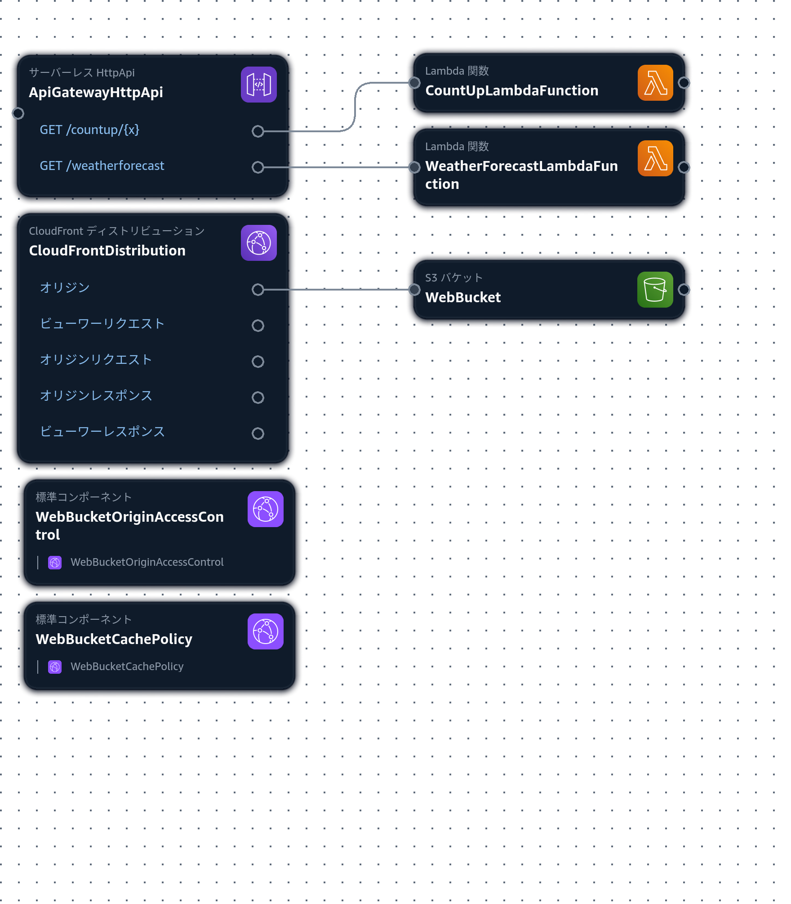

# aws_dotnet_aspire_blazor

※作成中

# TODO
* apigateway の url を web の appsettings.json に書き込む方法
* CDK
* フォルダ構成整理　src test
* Web に Web.Dev 追加？モック注入用。エントリーポイントとビュー関連をプロジェクト分ける？builderのextensions を別プロジェクトにする？
* メトリクス
* template.yaml を CloudFront と ApiGateway でわける？そんなこと可能なの？
* デバッグ実行
* AppHost の実行方法、ログの確認方法
* Lambda の開発方法、テスト方法、デバッグ方法
* Web の開発方法、テスト方法、デバッグ方法
* Web のサービスモック

## 概要

クイック スタート: 初めての .NET.NET Aspire ソリューションを構築する  
https://learn.microsoft.com/ja-jp/dotnet/aspire/get-started/build-your-first-aspire-app?pivots=dotnet-cli  



## 詳細


### ソリューション作成 + α
```
dotnet new gitignore
dotnet new sln -n AspireAWSExample
```

### Shared 作成
```
dotnet new classlib -n AspireAWSExample.Shared
dotnet sln add AspireAWSExample.Shared
```

### Services 作成
```
dotnet new classlib -n AspireAWSExample.Services
dotnet sln add AspireAWSExample.Services
dotnet add AspireAWSExample.Services reference AspireAWSExample.Shared
```


### AppHost 作成
```
dotnet new aspire-apphost -n AspireAWSExample.AppHost -f net8.0 --no-https true
dotnet sln add AspireAWSExample.AppHost
dotnet add AspireAWSExample.AppHost package Aspire.Hosting.AWS
dotnet add AspireAWSExample.AppHost reference AspireAWSExample.Shared
```

AspireAWSExample.AppHost/Properties/launchSettings.json
```json
      "environmentVariables": {
        "ASPIRE_ALLOW_UNSECURED_TRANSPORT": "true" // 追加
      }
```

↓今のところ不要
```
dotnet add AspireAWSExample.AppHost package Aspire4Wasm
dotnet remove AspireAWSExample.AppHost package Aspire4Wasm
```
Aspire doesn't replace http client Uri with actual address in blazor webassembly standalone app because it don't have appsettings.json  
https://github.com/dotnet/aspire/issues/4785

### Web 作成
```
dotnet new blazorwasm -n AspireAWSExample.Web
dotnet sln add AspireAWSExample.Web
dotnet add AspireAWSExample.AppHost reference AspireAWSExample.Web
dotnet add AspireAWSExample.Web reference AspireAWSExample.Shared
dotnet add AspireAWSExample.Web reference AspireAWSExample.Services
```

↓今のところ不要
```
dotnet add AspireAWSExample.Web package Microsoft.Extensions.ServiceDiscovery
dotnet remove AspireAWSExample.Web package Microsoft.Extensions.ServiceDiscovery
```

### CounterLambdaFunction 作成
```
project_name=CounterLambdaFunction
dotnet new lambda.EmptyFunction -n AspireAWSExample.${project_name}
dotnet sln add AspireAWSExample.${project_name}/src/AspireAWSExample.${project_name}
dotnet sln add AspireAWSExample.${project_name}/test/AspireAWSExample.${project_name}.Tests
dotnet add AspireAWSExample.AppHost reference AspireAWSExample.${project_name}/src/AspireAWSExample.${project_name}
dotnet add AspireAWSExample.${project_name}/src/AspireAWSExample.${project_name} reference AspireAWSExample.Shared
dotnet add AspireAWSExample.${project_name}/test/AspireAWSExample.${project_name}.Tests reference AspireAWSExample.Shared
dotnet add AspireAWSExample.${project_name}/src/AspireAWSExample.${project_name} package Amazon.Lambda.APIGatewayEvents
dotnet add AspireAWSExample.${project_name}/test/AspireAWSExample.${project_name}.Tests package Amazon.Lambda.APIGatewayEvents
```

### WeatherForecastLambdaFunction 作成
```
project_name=WeatherForecastLambdaFunction
dotnet new lambda.EmptyFunction -n AspireAWSExample.${project_name}
dotnet sln add AspireAWSExample.${project_name}/src/AspireAWSExample.${project_name}
dotnet sln add AspireAWSExample.${project_name}/test/AspireAWSExample.${project_name}.Tests
dotnet add AspireAWSExample.AppHost reference AspireAWSExample.${project_name}/src/AspireAWSExample.${project_name}
dotnet add AspireAWSExample.${project_name}/src/AspireAWSExample.${project_name} reference AspireAWSExample.Shared
dotnet add AspireAWSExample.${project_name}/test/AspireAWSExample.${project_name}.Tests reference AspireAWSExample.Shared
dotnet add AspireAWSExample.${project_name}/src/AspireAWSExample.${project_name} package Amazon.Lambda.APIGatewayEvents
dotnet add AspireAWSExample.${project_name}/test/AspireAWSExample.${project_name}.Tests package Amazon.Lambda.APIGatewayEvents
```


### 実行

```
dotnet run --project AspireAWSExample.AppHost
```

```
dotnet run --project AspireAWSExample.Web
```

```
dotnet watch --project ./AspireAWSExample.Web
```

## CDK

※ SAM に変更したため CDK は削除

```
mkdir AspireAWSExample.CDK
(cd AspireAWSExample.CDK && cdk init --language csharp)
rm AspireAWSExample.CDK/src/AspireAwsExampleCdk.sln
dotnet sln add AspireAWSExample.CDK/src/AspireAwsExampleCdk
```
※上記コマンドでソリューションファイルを削除しているが、ソリューションファイルが複数あると C# の開発環境がおかしくなってインテリセンスが効かなくなったりする。

### cdk synth CDK スタックから AWS CloudFormation テンプレートを作成
```
(cd AspireAWSExample.CDK && cdk synth)
```
`AspireAWSExample.CDK/cdk.out` が作成される。  
`AspireAWSExample.CDK/cdk.out/AspireAwsExampleCdkStack.template.json` にテンプレートがある。  
テンプレートは AWS Infrastructure Composer で表示できる。

### AWS への接続確認
```
aws sts get-caller-identity
```

```
sam build --build-in-source
```
※`--build-in-source` を指定するとビルド時に CodeUri に指定したフォルダで直接ビルドする。指定しないと `/tmp` にコピーしてビルドするが、依存するプロジェクトまでコピーしてくれないのでエラーになる。  
https://docs.aws.amazon.com/ja_jp/serverless-application-model/latest/developerguide/serverless-sam-cli-using-build.html
※.NET のビルドで `--use-container` の指定はおすすめしない。.NET はビルドで `bin` や `obj` を生成するが、コンテナ内のパスで書き換わって VSCode の拡張機能がエラーを吐いたり、生成されたファイルやフォルダが root でないと操作できなくなったりする。


```
sam deploy \
    --stack-name AspireAWSExampleSAMStack \
    --region ap-northeast-1 \
    --capabilities CAPABILITY_IAM \
    --no-disable-rollback \
    --resolve-s3
```
※ build を忘れやすいので注意

```
sam delete --stack-name AspireAWSExampleSAMStack
```

### デプロイ


