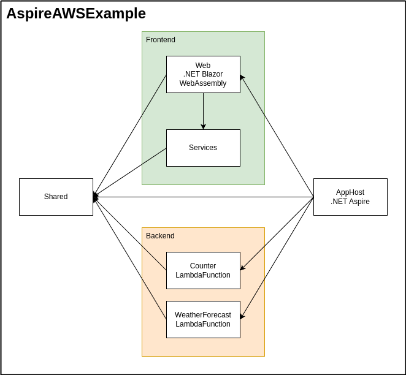

# ソリューション構築

## 概要


## 詳細

### ソリューション作成 + α
```
dotnet new gitignore
dotnet new sln -n AspireAWSExample
```

### Shared 作成
```
dotnet new classlib -n AspireAWSExample.Shared
dotnet sln add AspireAWSExample.Shared
```

### Services 作成
```
dotnet new classlib -n AspireAWSExample.Services
dotnet sln add AspireAWSExample.Services
dotnet add AspireAWSExample.Services reference AspireAWSExample.Shared
```


### AppHost 作成
```
dotnet new aspire-apphost -n AspireAWSExample.AppHost -f net8.0 --no-https true
dotnet sln add AspireAWSExample.AppHost
dotnet add AspireAWSExample.AppHost package Aspire.Hosting.AWS
dotnet add AspireAWSExample.AppHost reference AspireAWSExample.Shared
```

AspireAWSExample.AppHost/Properties/launchSettings.json
```json
      "environmentVariables": {
        "ASPIRE_ALLOW_UNSECURED_TRANSPORT": "true", // 追加
        "DOTNET_DASHBOARD_UNSECURED_ALLOW_ANONYMOUS": "true" // 追加
      }
```

AspireAWSExample.AppHost/appsettings.Development.json
```json
  "Dashboard": {
    "Frontend": {
      "AuthMode": "Unsecured" // 追加
    }
  }
```

### Web 作成
```
dotnet new blazorwasm -n AspireAWSExample.Web
dotnet sln add AspireAWSExample.Web
dotnet add AspireAWSExample.AppHost reference AspireAWSExample.Web
dotnet add AspireAWSExample.Web reference AspireAWSExample.Shared
dotnet add AspireAWSExample.Web reference AspireAWSExample.Services
```

### CounterLambdaFunction 作成
```
project_name=CounterLambdaFunction
dotnet new lambda.EmptyFunction -n AspireAWSExample.${project_name}
dotnet sln add AspireAWSExample.${project_name}/src/AspireAWSExample.${project_name}
dotnet sln add AspireAWSExample.${project_name}/test/AspireAWSExample.${project_name}.Tests
dotnet add AspireAWSExample.AppHost reference AspireAWSExample.${project_name}/src/AspireAWSExample.${project_name}
dotnet add AspireAWSExample.${project_name}/src/AspireAWSExample.${project_name} reference AspireAWSExample.Shared
dotnet add AspireAWSExample.${project_name}/test/AspireAWSExample.${project_name}.Tests reference AspireAWSExample.Shared
dotnet add AspireAWSExample.${project_name}/src/AspireAWSExample.${project_name} package Amazon.Lambda.APIGatewayEvents
dotnet add AspireAWSExample.${project_name}/test/AspireAWSExample.${project_name}.Tests package Amazon.Lambda.APIGatewayEvents
```

### WeatherForecastLambdaFunction 作成
```
project_name=WeatherForecastLambdaFunction
dotnet new lambda.EmptyFunction -n AspireAWSExample.${project_name}
dotnet sln add AspireAWSExample.${project_name}/src/AspireAWSExample.${project_name}
dotnet sln add AspireAWSExample.${project_name}/test/AspireAWSExample.${project_name}.Tests
dotnet add AspireAWSExample.AppHost reference AspireAWSExample.${project_name}/src/AspireAWSExample.${project_name}
dotnet add AspireAWSExample.${project_name}/src/AspireAWSExample.${project_name} reference AspireAWSExample.Shared
dotnet add AspireAWSExample.${project_name}/test/AspireAWSExample.${project_name}.Tests reference AspireAWSExample.Shared
dotnet add AspireAWSExample.${project_name}/src/AspireAWSExample.${project_name} package Amazon.Lambda.APIGatewayEvents
dotnet add AspireAWSExample.${project_name}/test/AspireAWSExample.${project_name}.Tests package Amazon.Lambda.APIGatewayEvents
```